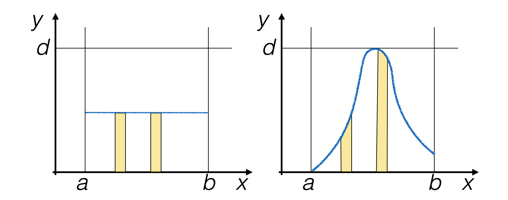
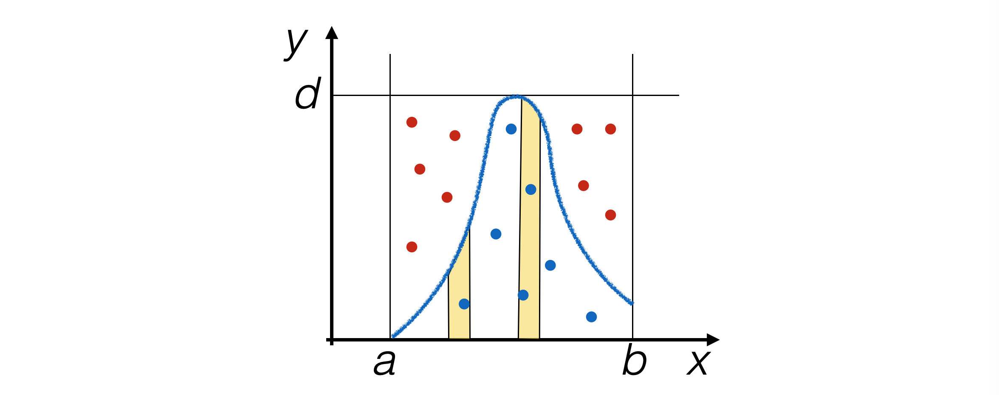
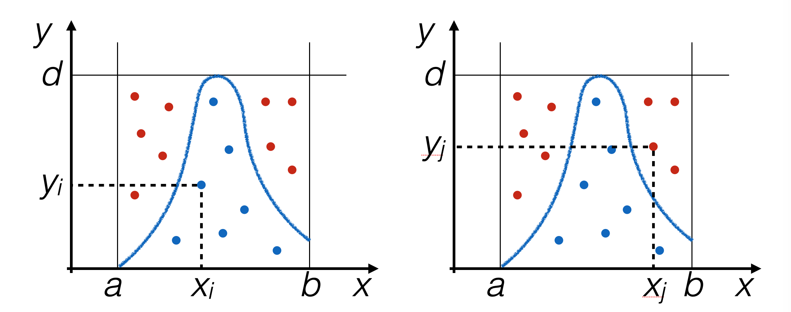

# Lezione 4: la generazione di numeri casuali

  * quando si effettua una qualunque misura,
    si porta a termine il **confronto fra i dati raccolti e un modello della natura**
    * per **falsificare il modello**, oppure
    * per **determinare il valore (e l'incertezza** associata) di uno dei suoi parametri
  * e' cruciale saper **calcolare le previsioni** di un modello
    * spesso **non si conosce** il modello in forma analitica 
      e si ricorre a **metodi computazionali alternativi** per ottenere le previsioni 
      da confrontare con le misure
  * molte tecniche di calcolo si basano sulla **generazione di numeri casuali**
    * per riprodurre la **natura aleatoria** delle misure
    * o per popolare uniformemente spazi fasi definiti entro **confini sofisticati**


## 4.1 la generazione di numeri casuali


### 4.1.1 sequenze casuali

  * un **processo casuale, o stocastico**,
    produce una successione di numeri distribuiti casualmente 
    secondo una distribuzione di probabilita' fissata
  * la probabilita' che un determinato numero compaia in qualunque punto della successione
    **non dipende dai numeri che lo precedono o che lo seguono**
  * ad esempio:
    * il **tempo di arrivo di raggi cosmici** su un rivelatore di muoni
    * il risultato del **lancio di una moneta** o di un dado
  * si tratta tipicamente di sequenze che **richiedono molto tempo** per essere compilate,
    che diventa un fattore limitante nei calcoli


### 4.1.2 sequenze pseudo-casuali

  * esistono programmi e librerie, 
    detti in generale **generatori di numeri pseudo-casuali**,
    che producono successioni di numeri tali da **sembrare** numeri casuali
  * la sequenza dei numeri nelle successioni e' deterministica,
    e le funzioni utilizzate per la generazione sono costruite per 
    **mimare il comportamento di successioni casuali**
  * il primo numero di una successione (o sequenza) di numeri pseudo-casuali
    si chiama *seed*,
    perche' noto quel numero e l'algoritmo di generazione 
    si puo' riprodurre l'intera sequenza
    * chiaramente, da diversi seed iniziano sequenze di numeri pseudo-casuali diverse


### 4.1.3 il generatore lineare congruenziale

  * un esempio di formula per **calcolare l'elemento successivo**
    di una sequenza pseudo-casuale dato un qualunque numero e' il seguente:

  * con:

  * il **primo elemento della sequenza**, con indice zero, e' il seed
  * questo algoritmo genera per costruzione **numeri compresi fra 0 ed M**


### 4.1.4 le problematiche dei generatori di numeri pseudo-casuali

  * la dipendenza funzionale fra due numeri pseudo-casuali consecutivi **non deve essere visibile**
  * se in una sequenza di numeri pseudo-casuali ricompare un numero gia' visto,
    la sequenza inizia a ripetersi da quel punto: 
    si tratta della **periodicita' del generatore**.
  * il periodo deve essere **molto maggiore** della quantita' di numeri pseudo-casuali generati
    e non dipendere dalla scelta del seed
  * tipicamente i generatori di numeri casuali seguono una distribuzione uniforme:
    la **non-uniformita'** della distribuzione e' un altro difetto tipico
    che si vuole evitare
  * un **esempio** del risultato di un generaore di numeri pseudo-casuali poco performante
    si trova [qui](https://boallen.com/random-numbers.html)


### 4.1.5 un generatore di numeri casuali in ```C++```

  * nella libreria ```cstdlib``` e' presente un generatore di numeri pseudo-casuali:
    ```cpp
    #include <cstdlib>
    #include <iostream>
    
    int main (int arcg, char ** argv)
      {
        for (int i = 0 ; i < 5 ; ++i)
          std::cout << "indice " << i << " --> " << rand () << "\n" ;
        std::cout << "\nRAND_MAX: " << RAND_MAX << std::endl ;
        return 0 ;
      }
    ```
    che produce come output:
    ```
    indice 0 --> 16807
    indice 1 --> 282475249
    indice 2 --> 1622650073
    indice 3 --> 984943658
    indice 4 --> 1144108930
    
    RAND_MAX: 2147483647
    ```


### 4.1.6 le caratteristiche di ```rand ()```

  * numeri interi pseudo-casuali distribuiti uniformemente fra ```0``` e ```RAND_MAX```,
    che e' una variabile definita all'interno della libreria ```cstdlib```
  * il generatore **inizia sempre dallo stesso seed** per generare gli eventi,
    quindi se si rigira il programma si ottiene sempre la medesima sequenza numerica


### 4.1.6 come cambiare il seed di generazione

  * esiste la funzione ```srand (int seed)``` che imposta il seed di generazione
    dei numeri casuali:
    ```cpp
    srand (3) ;
    for (int i = 0 ; i < 5 ; ++i)
      std::cout << "indice " << i << " --> " << rand () << "\n" ;
    ```
  * e' importante poter riprodurre una sequenza di numeri pseudo-casuali
    **a scopo di test**
  * se invece si vuole produrre **ad ogni esecuzione una sequenza differente**,
    si puo' utilizzare il tempo di esecuzione come seed di generazione,
    utilizzando la funzione ```time ()``` della libreria ```ctime```:  
    ```cpp
    #include <ctime>
    // resto del codice
    srand (time (NULL)) ;
    for (int i = 0 ; i < 5 ; ++i)
      std::cout << "indice " << i << " --> " << rand () << "\n" ;
    ```
  * a meno di avere importanti ragioni per fare diversamente,
    il seed **si inizializza una volta sola**
    durante l'esecuzione di un programma


### 4.2 ottenere diverse distribuzioni di numeri pseudo-casuali

  * una sequenza di numeri interi compresi fra ```0``` e ```RAND_MAX```
    non e' in generale ben adattata ad un suo uso generico
  * ci interessa produrre sequenze di numeri pseudo-casuali 
    che seguano distribuzioni differenti
  * le densita' di probabilita' dei numeri pseudo-casuali generati
    avranno sempre **dominio limitato**, 
    per via delle limitazioni intrinseche dei calcolatori  


### 4.2.1 una distribuzione uniforme di numeri razionali pseudo-casuali

  * una distribuzione uniforme di numeri casuali e' **definita su un insieme limitato**
    per costruzione, perche' altrimenti il suo integrale sarebbe divergente
  * l'obiettivo e' produrre numeri casuali compresi nell'intervallo ```min, max```,
    **partendo dalle risorse che abbiamo**, cioe' ```rand ()```
    1. **distribuzione uniforme fra ``0`` ed ``1``** : 
       ```cpp
       rand () / static_cast<float> RAND_RANGE ;
       ```  
    2. **dilatazione** fra ``0`` e ``max-min``:
       ```cpp
       (max - min) * rand () / static_cast<float> (RAND_MAX) ;  
       ```  
    4. **traslazione** di ```min```:
       ```cpp
       float rand_range (float min, float max)
         {
           min (max - min) * rand () / static_cast<float> (RAND_MAX) ;
         }  
       ```  


### 4.2.2 altre distribuzioni di probabilita'

  * secondo la distribuzione di densita' di probabilita' (pdf) uniforme,
    la probabilita' che eventi pseudo-casuali vengano generati in un dato intervallo
    **non dipende dalla posizione** dell'intervallo
  * per pdf non uniformi questo **non e' vero**




### 4.2.3 l'algoritmo try-and-catch (TAC)

  * generare eventi pseudo-casuali in modo **proporzionale all'area sottesa dalla pdf**



  * popolare il piano con coppie di numeri pseudo-casuali ```x,y```, 
    ciascuno generato uniformemente con ```rand_range ()```
    e utilizzare ```x``` solo se ```y < f(x)```




### 4.2.3 l'implementazione dell'algoritmo try-and-catch

  * per ripetere la generazione fino a che la condizione ```y < f(x)``` non e' soddisfatta,
    si utilizza un ciclo:
    ```cpp
    float rand_TAC (float f (float), float xMin, float xMax, float yMax)
      {
        double x = 0. ;
        double y = 0. ; 
        do {
          x = rand_range (xMin, xMax) ;
          y = rand_range (0, yMax) ;
        } while (y > f (x)) ;
        return x ; 
      }
    ```
  * la funzione ```rand_TAC``` ha bisogno di piu' argomenti rispetto a ```rand_range```:
    * un **limite superiore per l'asse verticale**: ```yMax```
    * la **forma funzionale** da usare come pdf: 
      come vedete anche una funzione puo' essere passata come argomento
      ad un'altra funzione, descrivendone il prototipo


### 4.2.3 vantaggi e svantaggi dell'algoritmo try-and-catch

  | vantaggi |
  | -------- |

  * **nota la forma funzionale** della pdf, l'algoritmo funziona
  * **non e' necessario che sia nota analiticamente**,
      e' sufficiente che si possa scrivere come funzione di ```C++```
  * facilmente **generalizzabile a N dimensioni** 

  | svantaggi |
  | --------- |

  * bisogna essere certi di **conoscere il massimo** (```yMax```) della funzione
  * ha **bassa efficienza**:
    * per ottenere un numero casuale, bisogna generarne di sicuro almeno due
    * spesso molti di piu', perche' molti punti sul piano vengono scartati


### 4.X titolo

  | testo |
  | -----------------------|


## 4.X ESERCIZI

  * Gli esercizi relativi alla prima lezione si trovano [qui](ESERCIZI.md)


