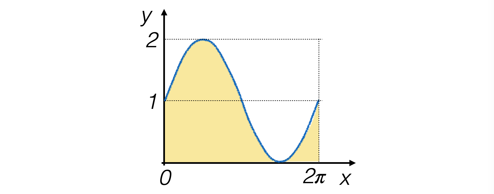
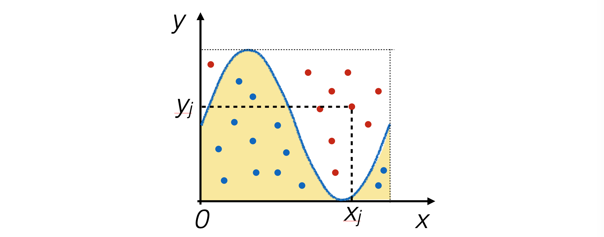
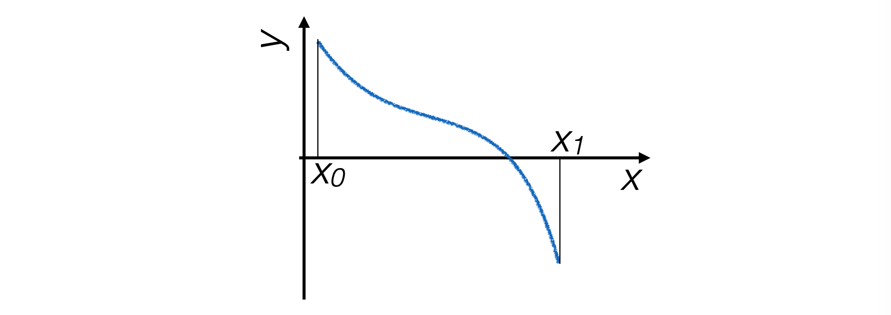
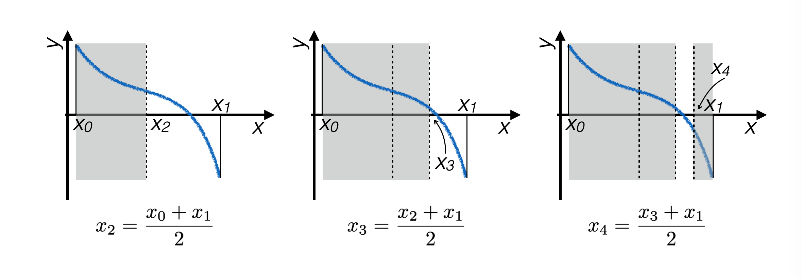
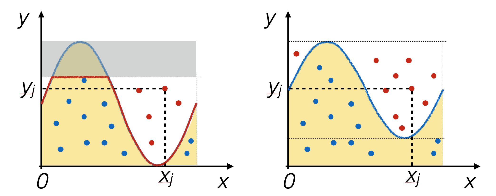
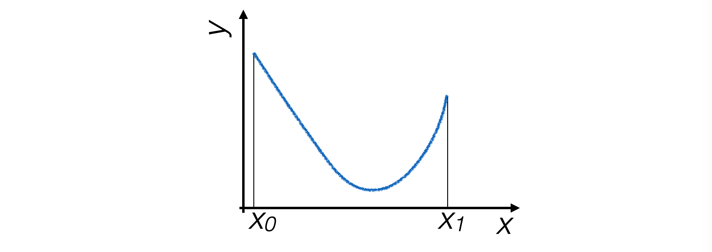
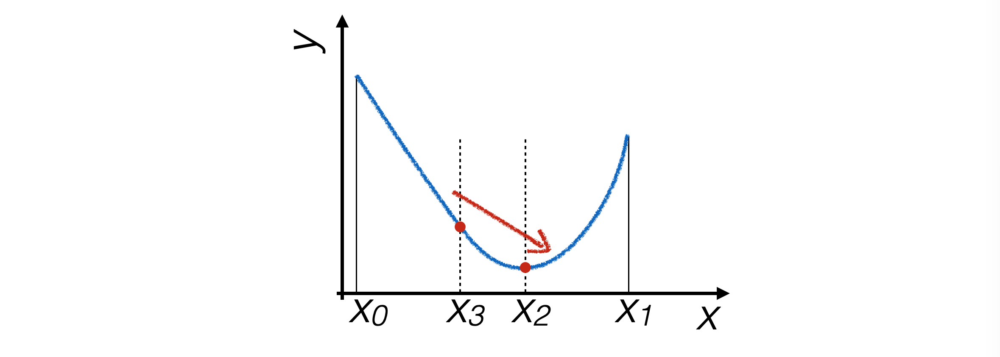
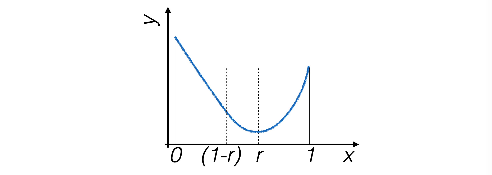
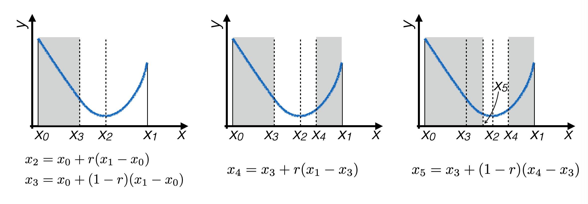

# Lezione 6: esempi di applicazione di sequenze pseudo-casuali ed esempi di calcolo numerico

## Indice

  * [6.1 la riproduzione simulata di un esperimento: i *toy experiment*](#61-la-riproduzione-simulata-di-un-esperimento-i-toy-experiment)
    * [6.1.1 la precisione sulla media di una misura](#611-la-precisione-sulla-media-di-una-misura)
    * [6.1.2 la visualizzazione della distribuzione delle medie](#612-la-visualizzazione-della-distribuzione-delle-medie)
    * [6.1.3 il confronto con la deviazione standard della media](#613-il-confronto-con-la-deviazione-standard-della-media)
  * [6.2 integrazione con numeri pseudo-casuali](#62-integrazione-con-numeri-pseudo-casuali)
    * [6.2.1 prerequisiti](#621-prerequisiti)
    * [6.2.2 il metodo hit-or-miss](#622-il-metodo-hit-or-miss)
    * [6.2.3 la precisione del metodo](#623-la-precisione-del-metodo)
    * [6.2.4 l'incertezza numerica del metodo hit-or-miss](#624-lincertezza-numerica-del-metodo-hit-or-miss)
    * [6.2.5 l'implementazione del metodo hit-or-miss](#625-limplementazione-del-metodo-hit-or-miss)
    * [6.2.6 il metodo del *crude Monte Carlo*](#626-il-metodo-del-crude-monte-carlo)
  * [6.3 aree positive o negative: alla ricerca degli zeri di una funzione](#63-aree-positive-o-negative-alla-ricerca-degli-zeri-di-una-funzione)
    * [6.3.1 il metodo della bisezione](#631-il-metodo-della-bisezione)
    * [6.3.2 una impoementazione dell'algoritmo di bisezione](#632-una-impoementazione-dellalgoritmo-di-bisezione)
    * [6.3.3 una impoementazione dell'algoritmo di bisezione in modo ricorsivo](#633-una-impoementazione-dellalgoritmo-di-bisezione-in-modo-ricorsivo)
  * [6.4 informazioni necessarie: gli estremi di una funzione](#64-informazioni-necessarie-gli-estremi-di-una-funzione)
    * [6.4.1 la ricerca di estremanti: il metodo della sezione aurea](#641-la-ricerca-di-estremanti-il-metodo-della-sezione-aurea)
    * [6.4.2 il criterio di restringimento](#642-il-criterio-di-restringimento)
    * [6.4.3 l'ottimizzazione della scelta dei punti](#643-lottimizzazione-della-scelta-dei-punti)
  * [6.5 mettere tutto insieme](#65-mettere-tutto-insieme)
  * [6.6 ESERCIZI](#66-esercizi)


## 6.1 la riproduzione simulata di un esperimento: i *toy experiment*

  * Le sequenze di numeri pseudo-casuali
    sono molto spesso utilizzate
    per **simulare il comportamento statistico di un esperimento** di misura,
    o per **eseguire integrazioni numeriche**
  * Secondo il paradigma frequentista della statistica,
    le incertezze di una misura si ricavano dalla sua distribuzione di densità di probabilità,
    assumendo che l'esperimento utilizzato per compiere quella misura
    sia **ripetuto un grande numero di volte**
  * Operativamente, 
    l'esperimento che porta al risultato finale di una misura è unico,
    dunque alcuni comportamenti statistici
    si possono **solamente simulare** 
  * La simulazione di un esperimento di misura è detta **toy experiment**


### 6.1.1 la precisione sulla media di una misura

  * Per determinare la precisione sulla media di una campione,
    quindi,
    è necessario effettuare la generazione del campione molte volte,
    per vedere la distribuzione dei valori della media:
    ```cpp
    // loop sui toy experiment
    stats s_singleToy ;
    stats s_tot ;
    for (int iToy = 0 ; iToy < NToys ; ++iToy)
      {
        int i = 0 ;
        // il loop seguente è un singolo toy experiment
        while (i++ < NMAX) s_singleToy.addEvent (rand_range (-3., 3.)) ;
        s_tot.addEvent (s_singleToy.getMean ()) ;
        s_singleToy.reset () ;
      } // loop sui toy experiment
    ```
    * **NOTA BENE**: l'oggetto ```s_singleToy``` viene vuotato al termine di ogni toy experiment
  * Mentre l'oggetto ```s_singleToy``` raccoglie le **statistiche di ogni singolo toy experiment**
    e viene utilizzato per calcolarne la media,
    l'oggetto ```s_tot``` raccoglie il campione dei valori delle medie 
    per tutti i toy experiment


### 6.1.2 la visualizzazione della distribuzione delle medie

  * La media delle misure è una funzione di variabili casuali,
    quindi è una **variabile casuale** a sua volta
  * La sua distribuzione di probabilità si ottiene **per campionamento** con i toy experiment,
    ad esempio riempiendo un istogramma all'interno del ciclo sui toy:
    ```cpp

    TH1F h_medie ("h_medie", "distribuzione delle medie", 41, -0.5, 0.5) ;
    // loop sui toy experiment
    for (int iToy = 0 ; iToy < NToys ; ++iToy)
      {
        int i = 0 ;
        // il loop seguente è un singolo toy experiment
        while (i++ < NMAX) s_singleToy.addEvent (rand_range (-3., 3.)) ;
        h_medie.Fill (s_singleToy.getMean ()) ;
    ```
  


### 6.1.3 il confronto con la deviazione standard della media

  * La **deviazione standard della media** per singolo toy,
    essendo l'incertezza associata alla media delle misure,
    deve quindi corrispondere
    alla **deviazione standard** del campione delle medie
  * Per controllare questa corrispondenza,
    si può utilizzare la classe ```statistiche```
    ```cpp
    stats s_singleToy ;
    stats s_tot ;
    stats s_incertezzaMedia ;
    // loop sui toy experiment
    for (int iToy = 0 ; iToy < NToys ; ++iToy)
      {
        int i = 0 ;
        // il loop seguente è un singolo toy experiment
        while (i++ < NMAX) s_singleToy.addEvent (rand_range (-3., 3.)) ;
        s_tot.addEvent (s_singleToy.getMean ()) ;
        s_incertezzaMedia.addEvent (s_singleToy.getSigmaMean ()) ;
        s_singleToy.reset () ;
      } // loop sui toy experiment
    ```
    che produce come risultato:
    ```
    media delle deviazioni standard della media per i singoli toy: 0.0773579 
    deviazione standard della distribuzione delle medie dei singoli toy: 0.0774481 
    ```


## 6.2 integrazione con numeri pseudo-casuali

  * Le sequenze di numeri pseudo-casuali possono essere utilizzate efficacemente
    anche per **calcolare aree** sottese da funzioni
  * I metodi che sfruttano numeri pseudo-casuali prendono il nome di tecniche **Monte Carlo**,
    derivando questa definizione dall'omonimo casinò,
    regno della dea bendata
  * L'utilizzo di queste tecniche in fisica è **molto vasto**,
    ad esempio nel calcolo di integrali in meccanica quantistica e teoria quantistica dei campi,
    per la simulazione di apparati di misura, et cetera
    


### 6.2.1 prerequisiti

  * Studiamo il caso di integrazione di **funzioni mono-dimensionali positive, continue 
    e definite su un intervallo compatto e connesso**
    (quindi finite su tutto l'insieme di definizione)
  * Sia data come esempio la funzione *g(x) = sin(x) + 1* definita sull'intevallo *(0, &pi;)*
    * per questa funzione sappiamo calcolare l'integrale in forma analitica,
      pari a *2&pi;*

  


### 6.2.2 il metodo hit-or-miss

  * L'**algoritmo hit-or-miss** si comporta in modo simile alla generazione di numeri pseudo-casuali
    con la tecnica try-and-catch
  * Si generano *N* coppie numeri pseudo-casuali nel piano che contiene il disegno della funzione
    e si conta il **numero di eventi** *n<sub>hit</sub>* che cascano nell'area sottesa dalla funzione 
  
  * Di conseguenza, se *A* è l'area del rettangolo dove sono stati generati gli eventi 
    ed *m* ed *M* gli estremi di integrazione:
  


### 6.2.3 la precisione del metodo

  * Non si possono generare infiniti numeri pseudo-casuali, 
    dunque il **risultato sarà approssimato**:
  
  * La quantità *I* è il *risultato dell'integrale* per il metodo hit-or-miss
  * Essendo funzione di numeri pseudo-casuali, è a sua volta un **numero pseudo-casuale**
  * Ha un valore atteso ed una varianza
    quest'ultima è **l'incetezza numerica** nel calcolo dell'integrale
    * *A* ed *N* sono **noti senza incertezza**
    * *n<sub>hit</sub>* ha invece **distribuzione binomiale**,
      associando al successo il fatto che un punto generato si trovi sotto la funzione da integrare,
      con **probabilità *p = n<sub>hit</sub> / N***


### 6.2.4 l'incertezza numerica del metodo hit-or-miss

  * **Valore di aspettazione e varianza** di *I* quindi, 
    dati *N* numeri pseudo-casuali geneati,
    sono quindi:
  
  * Di conseguenza, 
    l'incertezza numerica sul calcolo dell'integrale
    è data dalla **radice della varianza**


### 6.2.5 l'implementazione del metodo hit-or-miss

  * Anche in questo caso, 
    si tratta di **generare numeri pseudo-casuali** sul piano
    entro *(0, 2&pi;)* sull'asse *x* e *(0, 2)* sull'asse *y*
    e contare quante coppie di punti stiano sotto la funzione da integrare:
    ```cpp
    int N = 10000 ;
    int nHit = 0 ;
    double xMin = 0. ;
    double xMax = 2*M_PI ; 
    double yMin = 0. ; 
    double yMax = 2. ;

    for (int i = 0 ; i < N ; ++i) 
      {
        if (isBelow (fsin, xMin, xMax, yMin, yMax) == true) ++nHit ; 
      }
    ```
    dove:
    ```cpp
    bool isBelow (double g (double), double xMin, double xMax,
                  double yMin, double yMax)
      {
        double x = rand_range (xMin, xMax) ;
        double y = rand_range (yMin, yMax) ; 
        if (y < g (x)) return true ; 
        return false ;
      }
    ```
  * A partire da n<sub>hit</sub>, quindi, si possono calcolare il valore dell'integrale 
    e la sua incertezza.


### 6.2.6 il metodo del *crude Monte Carlo*

  * L'agoritmo *crude Monte Carlo* 
    sfrutta le proprietà del **valore di aspettazione** di una funzione
  * Dato un insieme di numeri pseudo-casuali *x<sub>i</sub>* 
    generati secondo una distribuzione di probabilità uniforme *f(x)*, 
    il **valore di aspettazione della funzione *g(x)***
    risulta essere:
    
    per definizione della distribuzione di probabilità uniforme
  * *E[g(x)]* è stimabile con la **media dei valori *g(x<sub>i</sub>)***
    e la varianza di *g(x)* è stimabile con la 
    **deviazione standard della media dei valori *g(x<sub>i</sub>)***,
    che si calcola a partire dalla varianza *V[g(x)]*
  * Dunque si può calcolare una stima dell'integrale di *g(x)* e della sua incertezza:
    


## 6.3 aree positive o negative: alla ricerca degli zeri di una funzione

  * Se una funzione ha anche una **parte negativa**,
    gli algoritmi di calcolo dell'integrale devono tenerne conto
    dividendo le regioni da integrare in positiva e negativa
  * Esistono tecniche per **trovare gli zeri** di una funzione  
  * Ipotesi sempici:
    * Funzione *g(x)* **continua definita su un intervallo compatto e connesso** *[x<sub>0</sub>, x<sub>1</sub>]*
    * La funzione ha **un solo zero** nell'intervallo
    * Agli estremi dell'intervallo, i valori della funzione **hanno segno opposto**
    


### 6.3.1 il metodo della bisezione

  * Il programma non vede la funzione nella sua interezza,
    quindi l'unico modo che ha per determinare dove sia lo zero 
    è **stimare la funzione in singoli punti**
  * Date le ipotesi iniziali,
    lo zero della funzione si trova sicuramente fra due punti tali per cui
    la funzione **assume valore con segno opposto** fra questi due punti  
  * La tecnica della bisezione **restringe iterativamente questo intervallo**  
    fino a che non diventa più piccolo di una risoluzione fissata
    


### 6.3.2 una impoementazione dell'algoritmo di bisezione

  * Ad ogni iterazione,
    si calcola il **punto medo dell'intervallo** che contiene lo zero
    e si decide se lo zero stia alla sua destra o alla sua sinistra
    ```cpp
    double bisezione (
      double g (double),
      double xMin,
      double xMax,
      double precision = 0.0001
    )
    {
      double xAve = xMin ;
      while ((xMax - xMin) > precision)
        {
          xAve = 0.5 * (xMax + xMin) ;
          if (g (xAve) * g (xMin) > 0.) xMin = xAve ;
          else                          xMax = xAve ;
        }
      return xAve ;
    }  
    ```


### 6.3.3 una impoementazione dell'algoritmo di bisezione in modo ricorsivo

  * L'algoritmo di bisezione effettua ripetutamente la **stessa operazione**
    in maniera ricorsiva
  * Questo comportamento si può anche implementare in ```C++```, 
    scrivendo una **funzione ricorsiva**,
    cioè che invoca se stessa:  
    ```cpp
    double bisezione_ricorsiva (
      double g (double),
      double xMin,
      double xMax,
      double precision = 0.0001
    )
    {
      double xAve = 0.5 * (xMax + xMin) ;
      if ((xMax - xMin) < precision) return xAve ;
      if (g (xAve) * g (xMin) > 0.) return bisezione_ricorsiva (g, xAve, xMax, precision) ;
      else                          return bisezione_ricorsiva (g, xMin, xAve, precision) ;
    }  
    ```

  | attenzione |
  | -------- |

  * In ogni funzione ricorsiva, devono essere presenti **due elementi**:
    * L'**invocazione della funzione** stessa
    * La **condizione di uscita** dalla sequenza di auto-invocazioni


## 6.4 informazioni necessarie: gli estremi di una funzione

  * Il metodo di hit-or-miss necessita della **conoscenza del valore massimo**
    che assume *g(x)* sull'intervallo di integrazione,
    altrimenti non vengono generati punti in alcune zone
    e la funzione effettivamente integrata è diversa
  * Conoscere il **valore minimo** assunto dalla funzione permette di 
    rendere l'algoritmo più efficiente,
    evitando di generare punti in rettangoli sotto la funzione,
    per i quali l'area si calcola banalmente
    


### 6.4.1 la ricerca di estremanti: il metodo della sezione aurea
  
  * Ipotesi sempici:
    * funzione *g(x)* **continua definita su un intervallo compatto e connesso** *[x<sub>0</sub>, x<sub>1</sub>]*
    * la funzione ha **un solo estremante** nell'intervallo
    
  * Anche in questo caso si procede per passi,
    **restringendo ad ogni iterazione l'intervallo** che contiene l'estremante
    fino a che diventa più piccolo di una precisione prefissata


### 6.4.2 il criterio di restringimento
  
  * Per trovare il minimo di una funzione servono abbastanza punti da **capirne la pendenza** 
    in diverse regioni dell'intervallo, 
    quindi se ne cercano quattro, che determinano tre intervalli
  * L'intervallo si stringe **eliminando il tratto dove il minimo di sicuro non c'è**.
    
  * L'iterazione successiva si restringe a
    *[x<sub>3</sub>, x<sub>1</sub>]* se *g(x<sub>3</sub>) > g(x<sub>2</sub>)*,
    altrimenti si restringe a *[x<sub>o</sub>, x<sub>2</sub>]*


### 6.4.3 l'ottimizzazione della scelta dei punti
  
  * Per ottimizzare il calcolo,
    i punti *x<sub>2</sub>, x<sub>3</sub>* vengono scelti in modo
    che uno dei due possa essere **utilizzato anche nell'iterazione seguente**,
    garantendo la stessa proporzione di suddivisione dell'intervallo
    
  * Perché questo sia possibile deve valere:
    
  * Dunque **il processo iterativo si restringe** intorno all'estremante della funzione:  
    


## 6.5 mettere tutto insieme

  * Esistono **molte tecniche** di ricerca di zeri ed estremanti di funzioni,
    che sono spesso il nocciolo duro di software di analisi dati  
  * Una collezione di algoritmi si trova nel volume **[numerical recipes](http://numerical.recipes/)**
  * Oltre al problema locale di compiere operazioni in condizioni di buona regolarità,
    algoritmi generici devono anche trovare il modo di
    **ricondurre un problema generale a casi semplici**
    * Ad esempio, nel caso della ricerca di minimi 
      bisogna evitare che gli algoritmi trovino minimi locali
      e non identifichino il **minimo globale** di una funzione
  * La funzionalità di un algoritmo dipende criticamente dalla **dimensione
    dello spazio di definizione** delle funzioni   


## 6.6 ESERCIZI

  * Gli esercizi relativi alla lezione si trovano [qui](ESERCIZI.md)


