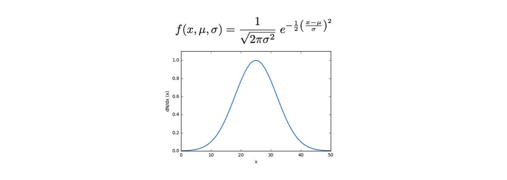

# Lezione 9: stima di parametri con il metodo della massima verosimiglianza


## 9.1 Introduzione

  * Studiamo la statistica nel **paradigma frequentista**,
    secondo il quale la probabilita' e' definita operativamente 
    come la frazione di volte in cui una misura ha un determinato risultato, 
    rispetto ad un totale molto grande
  * Il **risultato di un esperimento** di misura
    e' uno dei possibili risultati date le configurazioni iniziali


### 9.1.1 Un modello che descrive i dati

  * Un **modello** e' una distribuzione di probabilita' *f*
    o una legge *g* alla quale ci si aspetta che le misure obbediscano.
  * I **risultati delle misure** sono ovviamente variabili 
    rispetto alle quali il modello dipende
  * Ulteriori variabili presenti nel modello,
    che non sono misurate,
    sono dette **parametri**.


### 9.1.2 Distribuzioni di probabilita'

  * Dato un insieme di misure reali *x<sub>i</sub>* definite su un insieme &Omega; 
    indipendenti identicamente distribuiite,
    sappiamo che seguono una **data distribuzione di densita' probabilita'**, 
    indicata genericamente come *f(x, &theta;)*
  * Questo significa che *f(x<sub>i</sub>, &theta;)* e' **la densita' di probabilita'**
    che la misura avvenga nel punto x<sub>i</sub> dell'insieme di definizione &Omega;.
  * Il **simbolo &theta;** indica che la funzione di densita' di probabilita' *f*
    dipende da altre variabili oltre che *x*
    * &theta; puo' anche essere un vettore di parametri
    * Ad esempio, una **distribuzione Gaussiana** ha due parametri aggiuntivi, &mu; e &sigma;:
    


### 9.1.3 La determinazione dei parametri

  * Spesso l'obiettivo di un esperimento e' la **stima dei parametri** di un modello
  * Per ottenere questo risultato, 
    si **raccolgono molti dati** *x<sub>i</sub>* e si utilizzano come input
    ad algoritmi, detti **stimatori**, che stimino i parametri di interesse
  * Le **stime** prodotte da uno stimatore **sono variabili casuali**, 
    perche' tramite gli stimatori sono funzioni di numeri casuali (i dati)
    * Hanno una propria distribuzione di probabilita'
    
  * Esistono programmi che svolgono il compito per noi. 
    Fra questi, ```ROOT``` contiene diversi algoritmi per farlo.
    In gergo, **l'operazione di determinazione dei parametri e' chiamata *fit***,
    cioe' adatattamento.


### 9.2 La massima verosimiglianza


### 9.1.1 Diversi strumenti per stimare parametri

  * basato sulla probabilita' dei dati dato il modello: massima verosimiglianza
  * basato su una distanza fra dati e modello: minimi quadrati


### 9.1.2 Diversi campioni 

  * insieme di eventi, distribuzione non binnata
  * insieme di eventi, distribuzione binnata
  * relazione fra coppie di eventi *(x<sub>i</sub>, y<sub>i</sub>)* con relazione attesa *y = f(x, &theta;)*


### 9.1.2 Tabella riassuntiva 


## 9.2 La massima verosimiglianza: un ripasso veloce

  * come di scrive la likelihood
  * il principio di massima verosimiglianza
  * gli stimatori sono variabili casuali
    * hanno una distribuzione attesa


## 9.2 La massima verosimiglianza: un ripasso veloce


## 9.8 ESERCIZI

  * Gli esercizi relativi alla lezione si trovano [qui](ESERCIZI.md)


