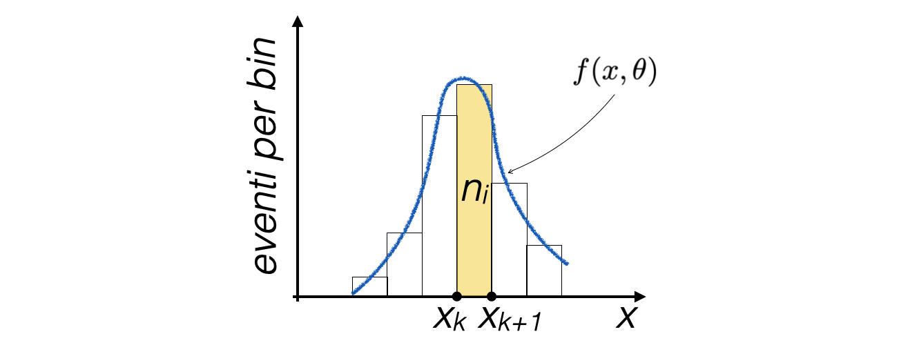

# Lezione 11: fit di distribuzioni binnate con ```ROOT```


## 11.1 Introduzione

  * I metodi dei minimi quadrati e della massima verosimiglianza
    possono essere **applicati anche al caso di istrogrammi**,
    cioè di distribuzioni binnate, 
    dove si voglia fittare una funzione alla distribuzione dei conteggi nei bin:

  * In questo caso, il contenuto di ogni bin è un numero di eventi *n<sub>i</sub>*
  * Se il numero di bin e il numero medio di eventi in ciascuno di essi non è piccolo,
    si può assumere che la variabile casuale *n<sub>i</sub>* segua
    una **statistica di Poisson**


### 11.1.1 L'applicazione del metodo dei minimi quadrati

  * Nel caso dei minimi quadrati, 
    la funzione ***Q<sup>2</sup>(&theta;)*** è solitamente la seguente (formulazione di Neyman):

  * Il valore di *y<sub>i</sub>* della lezione scorsa è **costituito da *n<sub>i</sub>*** 
  * L'**incertezza su *n<sub>i</sub>*** è data dalla sua radice quadrata,
    secondo la statistica di Poisson
  * Il valore di *x<sub>i</sub>* è il **centro del bin corrispondente**
  * Il numero di bin dell'istogramma è *N*


### 11.1.2 L'applicazione del metodo della massima verosimiglianza

  * Nel caso della massima verosimiglianza, 
    si assume che in ogni bin i conteggi seguano una **distribuzione di probabilità Poissoniana**
    con valore atteso *&mu; = f(x<sub>i</sub>, &theta;)*:


### 11.1.3 La scelta fra le due tecniche

  * Nel caso di **pochi conteggi** presenti nei bin,
    * bin senza conteggi non contribuiscono al fit nel caso dei minimi quadrati, 
      nonostante l'assenza di eventi sia un'informazione importante
    * consigliato utilizzare il metodo della **massima verosimiglianza**
  * Nel caso di **molti conteggi** presenti nei bin,
    i due metodi sono equivalenti
    e spesso il metodo dei **minimi quadrati** è computazionalmente più semplice


## 11.2 Un esercizio di regressione


https://root.cern.ch/root/htmldoc/guides/users-guide/FittingHistograms.html


## 11.7 ESERCIZI

  * Gli esercizi relativi alla lezione si trovano [qui](ESERCIZI.md)
