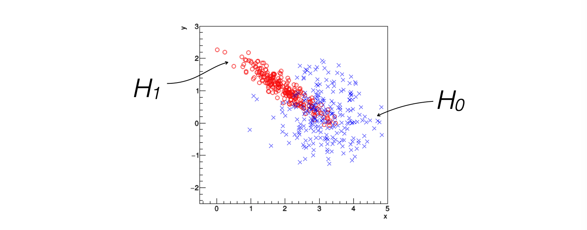
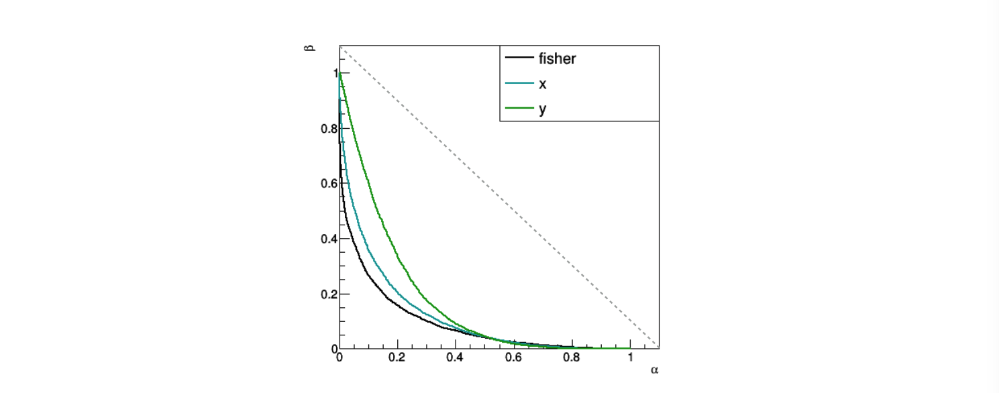

# Lezione 12: Test di Ipotesi


## 12.1 Introduzione

  * Descrizione delle proprietà di un sample
  * Separazione fra due possibili ipotesi:
    * Ricorda l'approccio frequentista
  * Due modi di usare la separazione fra ipotesi
    * decidere se una misura è meglio descritta da un modello o da un altro
    * categorizzazione di eventi in due classi separate


## 12.2 Decorrelazione lineare di variabili

  * Dato un campione di *N* misure (*x*<sub>i</sub>, *y*<sub>i</sub>) indipendenti ed identicamente distribuite,
    in generale la variabile *x* può essere **linearmente correlata con la variabile *y***,
    cioè la covarianza &sigma;<sub>xy</sub> calcolata fra le due variabili può essere diversa da zero.
  * In questo caso,
    la matrice di covarianza associata al modello che descrive la misura, cioè alla popolazione,
    non è diagonale:
    


### 12.2.1 Un cambio di coordinate

  * Siccome la covarianza descrive il livello di correlazione lineare che sussiste fra due variabili,
    esiste sempre un cambio di variabili nello spazio delle fasi del campione
    tale per cui **le variabili trasformate siano non correlate fra di loro**
    


### 12.2.2 Una rotazione della matrice di covarianza

  * Nel nuovo sistema di riferimento,
    la **matrice delle covarianze risulta quindi diagonale**
  * Questo non ci stupisce, 
    perché essendo simmetrica la matrice delle covarianze è sempre diagonalizzabile
  * Una trasformazione unitaria che diagonalizzi la matrice delle covarianze è **una rotazione di un angolo &theta;**
  * Data una matrice simmetrica 2x2:
    
  * l'angolo di rotazione si calcola come:
    
  * che per il caso della matrice delle covarianze diventa:
    


### 12.2.3 La rotazione delle variabili

  * Noto l'angolo di rotazione &theta;, la matrice di rotazione associata è:
    
  * Che corrisponde al cambio di variabili:
    
    


## 12.3 Un esempio di implementazione di decorrelazione

  * Sia dato il campione di *N* misure (*x*<sub>i</sub>, *y*<sub>i</sub>) sotto forma di un *file* di testo.
  * Dopo aver trasferito i valori contenuti nel *file* in due ```vector```, 
    si può **calcolare la matrice delle covarianze sul campione**
    ed utilizzare i valori ottenuti 
    come stimatori della matrice delle covarianze del modello,
    utilizzando la tecnica della sostituzione per il calcolo di stimatori.
  * A partire dalla matrice così ottenuta, 
    si può quindi **calcolare l'angolo di rotazione e trasformare le variabili**


### 12.3.1 La lettura del file di testo

  * Si esegue secondo le istruzioni già studiate durante la [Lezione 9](../Lezione_09/README.md),
    prestando attenzione al fatto che **le coppie di valori (*x*<sub>i</sub>, *y*<sub>i</sub>) 
    sono scritte una per riga**:
    ```cpp
    // apertura del file di testo
    double input_x ;
    double input_y ;
    while (true) 
      {
        input_file >> input_x ;
        input_file >> input_y ;
        if (input_file.eof () == true) break ;
        data_x.push_back (input_x) ;
        data_y.push_back (input_y) ;
      } 
    input_file.close () ;
    ```


### 12.3.2 La costruzione della matrice delle covarianze

  * I **termini sulla diagonale** della matrice delle covarianze 
    sono la varianza di ciascuna variabile:
    ```cpp
    #include "../../Lezione_09/programmi/statistiche_vector.h"
    // ...
    double V_xx = varianza (data_x) ;
    double V_yy = varianza (data_y) ;
    ```
  * Dove la funzione che calcola la varianza utilizza
    una ben nota formula:
    ```cpp
    template <class T>
    T varianza (const std::vector<T> & input_v) 
    {
      T somma = 0 ;
      T sommaSq = 0 ;
      for (int i = 0 ; i < input_v.size () ; ++i) 
        {
          somma += input_v.at (i) ;
          sommaSq += input_v.at (i) * input_v.at (i) ;
        }  
      return sommaSq / static_cast<float> (input_v.size ()) - 
             (somma / static_cast<float> (input_v.size ()) * somma / static_cast<float> (input_v.size ())) ;
    }
    ```


### 12.3.3 Il calcolo delle covarianze

  * La covarianza è definita come:
    
  * e può essere stimata sul campione come:
    
  * Il programma che implementa lo stimatore, dunque,
    esegue i seguenti calcoli:
    ```cpp
    double M_x = media (data_x) ;
    double M_y = media (data_y) ;
  
    double V_xy = 0. ;
    for (int i = 0 ; i < data_x.size () ; ++i)
      {
        V_xy += (data_x.at (i) - M_x) * (data_y.at (i) - M_y) ;
      }
    V_xy /= data_x.size () ;
    ```


### 12.3.4 L'angolo di rotazione ed il cambio di variabili

  * Nota la matrice di covarianza, si può quindi **calcolare l'angolo di rotazione**:
    ```cpp
    double theta = 0.5 * atan (2 * V_xy / (V_xx - V_yy)) ;
    double c_theta = cos (theta) ;
    double s_theta = sin (theta) ;
    ```
  * E quindi l'effettivo cambio di variabili:
    ```cpp
    vector<double> data_x_dec ;
    vector<double> data_y_dec ;
    for (int i = 0 ; i < data_x.size () ; ++i)
      {
        data_x_dec.push_back (data_x.at (i) * c_theta + data_y.at (i) * s_theta) ; 
        data_y_dec.push_back (data_y.at (i) * c_theta - data_x.at (i) * s_theta) ; 
      }
    ```  
    


## 12.4 Il discriminante di Fisher

  * Costruire una **combinazione lineare** delle variabili che caratterizzano gli eventi di interesse
    che serva per separare due ipotesi *H<sub>0</sub>* ed *H<sub>1</sub>*
  * Nel caso bidimensionale, dato un campione di eventi (*x*<sub>i</sub>, *y*<sub>i</sub>)
    1. **determinare il test statistico** *t(x,y)* da utilizzare per separare le due ipotesi
    2. **usare il test statistico** per distinguere le due ipotesi:

| ipotesi | regione corrispondente |
| *H<sub>0</sub>* | *t(x,y) < t<sub>cut</sub>*  |
| *H<sub>1</sub>* | *t(x,y) >= t<sub>cut</sub>* |


### 12.4.1 La determinazione della direzione del discriminante


  * Il test statistico è una *combinazione lineare* delle variabili che caratterizzano ogni evento:

  * che nel caso bidimnesionale diventa:

  * Il discriminante di Fisher è la determinazione dei coefficienti *f<sub>x</sub>* ed *f<sub>y</sub>*,
    cioè del vettore ***f***,
    tramite la seguente equazione:

  * dove: 
    * ***&mu;<sub>0</sub>*** e ***&mu;<sub>1</sub>*** rappresentano la media attesa
      nel caso di ipotesi *H<sub>0</sub>* ed *H<sub>1</sub>* rispettivamente
    * *W* è la somma delle matrici delle covarianze *V<sub>0</sub>* e *V<sub>1</sub>*
      per le ipotesi *H<sub>0</sub>* ed *H<sub>1</sub>* rispettivamente:


### 12.4.2 Due modelli da confrontare

  * Le medie ***&mu;<sub>i</sub>*** e le matrici delle covarianze *V<sub>i</sub>*
    possono essere determinate **a partire da campioni simulati** di eventi
    generati secondo due modelli *H<sub>0</sub>* ed *H<sub>1</sub>*.



### 12.4.3 Il calcolo delle matrici di covarianza

  * Supponendo che gli eventi simulati siano contenuti in due ```vector<vector<double> >```,
    le **matrici delle covarianze** possono essere calcolate:
    ```cpp
    #include "../../Lezione_10/programmi/algebra_2.h"
    // ...
    vector<vector<double> > data_1 ;
    // riempimento del vector
    matrice cov_1 = determinaCovarianza (data_1) ;
    ```
    * dove la funzione ```determinaCovarianza``` richiama le funzioni
      già definite in precedenza per il calcolo dei singoli elementi
      della matrice delle covarianze


### 12.4.4 Il calcolo delle medie

  * **La media** lungo la direzione *x* e *y* può altrettanto essere calcolata:
    ```cpp
    #include "../../Lezione_09/programmi/statistiche_vector.h"
    #include "../../Lezione_10/programmi/algebra_2.h"
    // ...
    vettore media_1 (2) ;
    media_1.setCoord (0, media (data_1.at (0))) ;
    media_1.setCoord (1, media (data_1.at (1))) ;
  
    vettore media_2 (2) ;
    media_2.setCoord (0, media (data_2.at (0))) ;
    media_2.setCoord (1, media (data_2.at (1))) ;

    ```    


### 12.4.5 Il calcolo della direzione del discriminante di Fisher

  * Con queste informazioni a disposizione,
    si può **determinare il vettore *f***:
    ```cpp

    matrice W = cov_1 + cov_2 ;
    vettore fisher = W.inversa () * (media_2 - media_1) ; 
    ```
  * Il vettore ***f*** corrisponde alla direzione di proiezione ottimale degli eventi
    lungo la quale separare le due ipotesi:


## 12.5 L'utilizzo del test statistico


### 12.5.1 Il calcolo del test statistico per i due campioni

  * Per ogni evento che compone i due modelli si può quindi **calcolare
    il valore del test statistico** *t<sub>i</sub> = t(x<sub>i</sub>,y<sub>i</sub>)*:
    ```cpp
    vector<double> fisher_1 ;
    for (int i = 0 ; i < data_1.at (0).size () ; ++i)
      {
        fisher_1.push_back (
          data_1.at (0).at (i) * fisher.at (0) + 
          data_1.at (1).at (i) * fisher.at (1)
        ) ;
      }
    ```
  * ed analogamente per il secondo campione, generando anche ```vector<double> fisher_2```


### 12.5.2 La visualizzazione dell'informazione disponibile

  * A questo punto,
    i due campioni sono **descritti da tre variabili**: *x*, *y* e *t*,
    dove la terza è una combinazione lineare delle prime due.
  * La distribuzione delle tre variabili mostra ad occhio la separazione
    delle distribuzioni di *H<sub>0</sub>* ed *H<sub>1</sub>*
    in ciascuna delle tre direzioni:

  * dove gli istogrammi sono stati riempiti a partire dal ```vector<double>```
    corrispondente a ciascuna variabile:
    ```cpp
    double max_x = *max_element (data.begin (), data.end ()) ;
    double min_x = *min_element (data.begin (), data.end ()) ;
    double sigma_x = sqrt (varianza (data)) ;
    int Nbins = 5 * (max_x - min_x) / sigma_x ;
  
    TH1F * h_vis = new TH1F (
        histo_name.c_str (), "distribuzione 1D",
        Nbins, min_x, max_x
      ) ;
  
    for (int i = 0 ; i < data.size () ; ++i)
      {
        h_vis->Fill (data.at (i)) ;
      }  
    ```


### 12.5.3 Il comportamento del test di ipotesi

  * Per valutare il comportamento del test di ipotesi basato sul test statistico *t(x,y)*
    si può valutare l'effetto della selezione con soglia *t<sub>cut</sub>*
    con la frazione di falsi positivi &beta; 
    e quella di falsi negativi &alpha;:


### 12.5.4 La curva ROC

  * L'andamento di &beta; in funzione di &alpha; al variare del valore di *t<sub>cut</sub>*
    è detto curva ROC:


### 12.5.5 L'algoritmo di costruzione

  * Per calcolarlo,
    bisogna scorrere i possibli valori di *t<sub>cut</sub>*
  * Per semplificare i conteggi,
    come prima cosa si ordinano i due ```vector<double>``` da confrontare
    in maniera crescente:  
    ```cpp
    sort (fisher_1.begin (), fisher_1.end ()) ;
    sort (fisher_2.begin (), fisher_2.end ()) ;
    ```
    * questa operazione modifica l'ordinamento nel campione, 
      quindi se l'ordinamento va preservato meglio è fare una copia
      dei vector per lavorarci
  * Poi si determinano il minimo ed il massimo valore per *t<sub>cut</sub>*
    in funzione dei valori assunti dagli eventi:
    ```cpp
    double taglio_min_f = *fisher_1.begin () ;
    if (*fisher_2.begin () < taglio_min_f) taglio_min_f = *fisher_2.begin () ;
  
    double taglio_max_f = *fisher_1.rbegin () ;
    if (*fisher_2.rbegin () > taglio_max_f) taglio_max_f = *fisher_2.rbegin () ;
    ```
    * sfruttando il fatto che i due ```vector<double>``` sono stati ordinati

### 12.5.6 Il riempimento della curva

  * Si decide con che passo scorrere la variabile *t<sub>cut</sub>*
    ```cpp
    double risoluzione = 10 * (taglio_max_f - taglio_min_f) / fisher_1.size () ;
    ```
  * Si riempie un ```TGrraph``` di ```ROOT``` con la successione dei punti
    *(&alpha;<sub>i</sub>, &beta;<sub>i</sub>)* calcolati a partire da ciascun *t<sub>i</sub>*:
    ```cpp
    TGraph g_ROC_f ;
  
    int contatore_1 = 0 ;
    int contatore_2 = 0 ;
    for (double taglio = taglio_min_f ; taglio < taglio_max_f ; taglio += risoluzione)
      {
        // conta il numero di eventi sotto soglia per ogni campione
        // (ricordando che i due campioni sono stati ordinati)
        for ( ; contatore_1 < fisher_1.size () ; ++contatore_1)
          if (fisher_1.at (contatore_1) > taglio) break ;
        for ( ; contatore_2 < fisher_2.size () ; ++contatore_2)
          if (fisher_2.at (contatore_2) > taglio) break ;
        g_ROC_f.SetPoint (g_ROC_f.GetN (), 
            static_cast<double> (contatore_2) / fisher_2.size (),
            1. - static_cast<double> (contatore_1) / fisher_1.size ()
          ) ;
      }

    ```


### 12.5.7 Il confronto con le altre variabili

  * Così come si è fatto per la variabile *t*, 
    il criterio di selezione per determinare se rigettare o meno l'ipotesi *H<sub>0</sub>*
    si sarebbe potuto **applicare anche alle variabili *x* o *y***
  * Per confrontare l'efficacia delle varie selezioni,
    si possono sovrapporre le curve ROC nei tre casi:

  * Alternativamente, si può confrontare anche l'area sottesa alle singole curve ROC:
    ```cpp
    variabile x:             0.12
    variabile y:             0.17
    discriminante di Fisher: 0.09
    ```
    * In questo frangente, 
      l'area sottesa ad un ```TGraph``` è stata calcolata con il [metodo dei trapezi](https://it.wikipedia.org/wiki/Regola_del_trapezio)


## 12.X ESERCIZI

  * Gli esercizi relativi alla lezione si trovano [qui](ESERCIZI.md)


